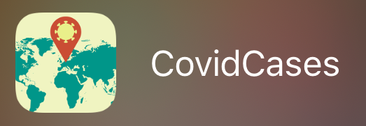
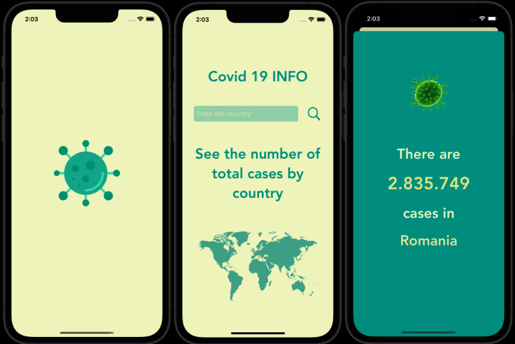

# CovidCases App

## About:
**CovidCases** is an app that helps you track the number of COVID-19 cases in each country.

**CovidCases** is a Swift App that shows the implementation of:
- API call and Networking
- AutoLayout
- Delegates and Protocols
## Screenshots:

