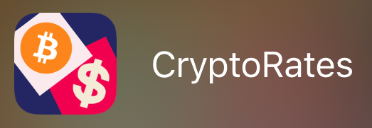
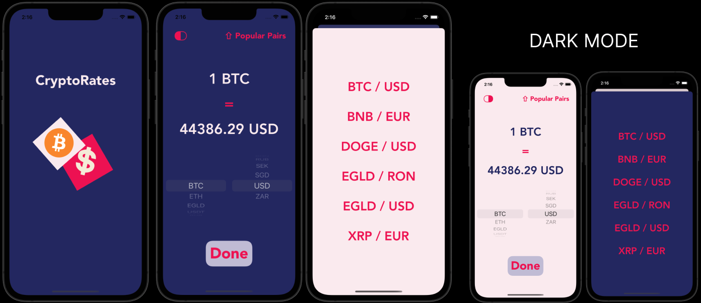

# CryptoRates

## About:
**CryptoRates** is an app that helps you track the prices of crypto currencies in real time.

**CryptoRates** is a Swift App that shows the implementation of:
- API call and Networking
- AutoLayout
- MVC Pattern
- Delegates and Protocols
## Screenshots:

