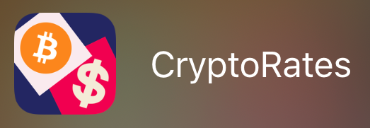

# This is my porfolio representing my iOS journey so far.
© Pudilic Eusebiu - iOS Developer

# 1. ToDo App

## About:
**ToDo** is an app that provides you a to-do list where you can write down all your tasks that are waiting for completion.

**ToDo** is a Swift App that shows the implementation of:
- CoreData (CRUD)
- MVC Pattern
- Custom TableView
- AutoLayout
- Delegates and Protocols

## Screenshots:

#
#
#
# 2. TicTacToe App

## About:
**TicTacToe** is a game app that represent an instance of the popular Tic Tac Toe game or NOUGHTS AND CROSSES.

**TicTacToe** is a Swift App that shows the implementation of:
- Sound integration
- Haptic feedback integration
- MVC Pattern
- AutoLayout
## Screenshots:

#
#
#
# 3. CryptoRates App

## About:
**CryptoRates** is an app that helps you track the prices of crypto currencies in real time.

**CryptoRates** is a Swift App that shows the implementation of:
- API call and Networking
- MVC Pattern
- AutoLayout
- Delegates and Protocols
## Screenshots:

#
#
#
# 4. CovidCases App

## About:
**CovidCases** is an app that helps you track the number of COVID-19 cases in each country.

**CovidCases** is a Swift App that shows the implementation of:
- API call and Networking
- MVC Pattern
- AutoLayout
- Delegates and Protocols
## Screenshots:

